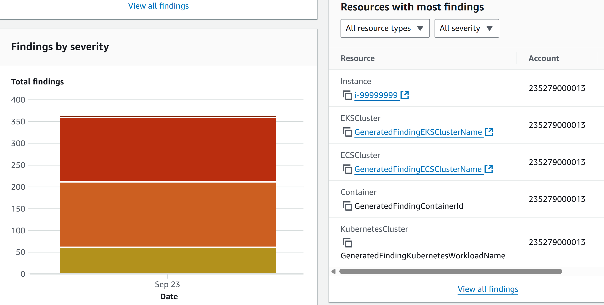
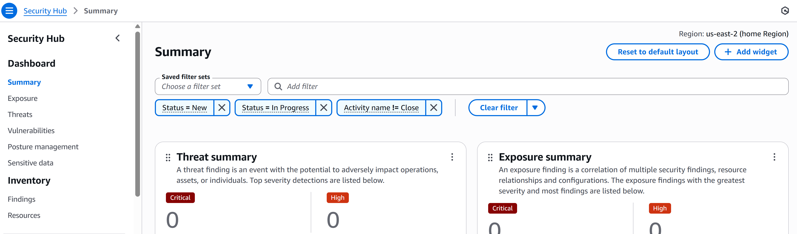

**cloud-security-monitoring-project**/
│── README.md
│── code/            # instead of scripts/
│    └── fetch_logs.py
│    └── analyze_findings.py
│── screenshots/
│    └── guardduty_alert.png
│    └── securityhub_dashboard.png
│── reports/

# AWS Security Monitoring Dashboard

## Overview
This project simulates a real-world **Cloud Security Analyst** workflow using AWS Free Tier.  
It monitors AWS accounts for threats, analyzes logs, and visualizes incidents.

## Tools & Services Used
- AWS CloudTrail
- AWS GuardDuty
- AWS Security Hub
- IAM (Identity & Access Management)
- Python (Boto3)
- Power BI Desktop
- GitHub for documentation

## Implementation Steps
1. Setup AWS Free Tier & Environment (Python, AWS CLI, Boto3, Power BI) ✅
2. Enable CloudTrail, GuardDuty, Security Hub
3. Simulate Security Events (IAM misconfigurations, S3 bucket exposure)
4. Fetch Logs with Python (Boto3)
5. Analyze Findings & Build Dashboard
6. Document Reports & Incident Response Playbook

## Results
- GuardDuty detected unusual IAM activity
- Security Hub aggregated findings
- Power BI Dashboard created to visualize incidents

## Screenshots

## 🧑‍💻 Author
Gayathri Dhasari Venkat Raja
